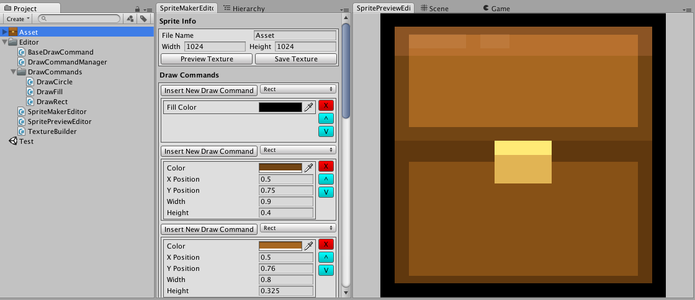
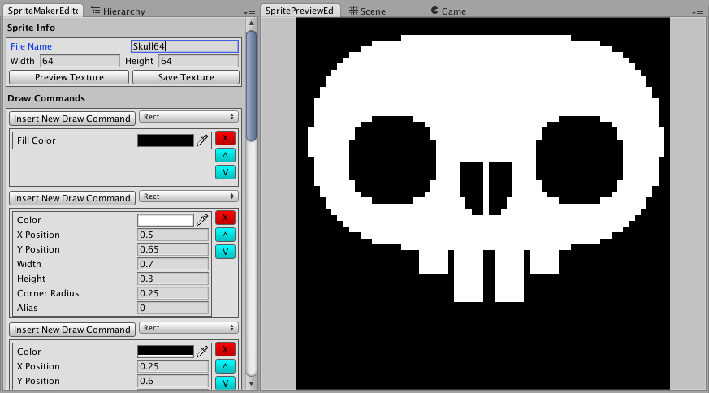
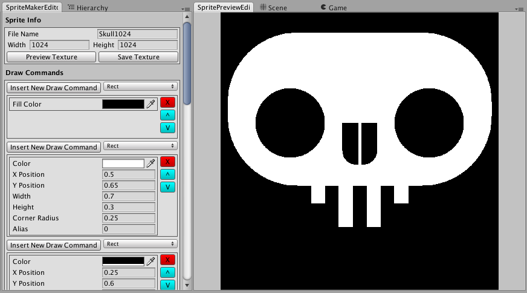

# Sprite Maker

SpriteMaker is a Unity add-on for quickly making basic UI or prototype art in unity.  I’m making SpriteMaker because when I do game jams or quick mock ups, I often think something like this:

_I need  64x64 rounded Rect for this panel..._

_A small half circle would be great here..._

SpriteMaker aims to reduce the friction of cracking open a graphics program (or bugging an artist) to create quick assets like this.  I’m developing it in the open because I don’t really have the time to deal with putting it on the asset store and provide support, but I think people might get some use out of it (or create cool Draw Commands!).

The add-on is still under development, much of the feature set is still TBA.   

[Roadmap](Roadmap.md)
[Usage](Usage.md)

##Gallery

By Defining shapes relative to the canvas, you can rescale the canvas at will to export a set of draw commands at a variety of sizes. 

