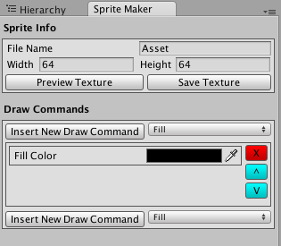
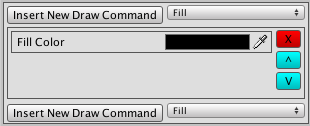
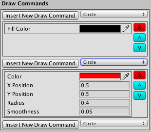
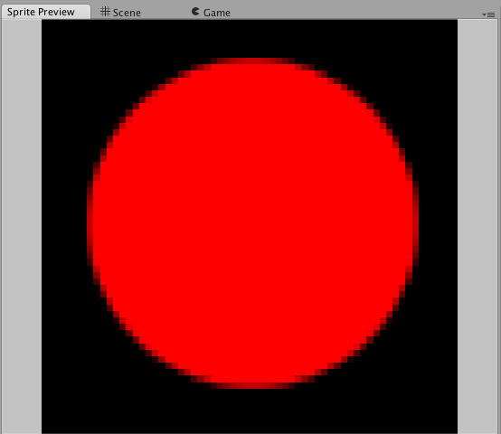
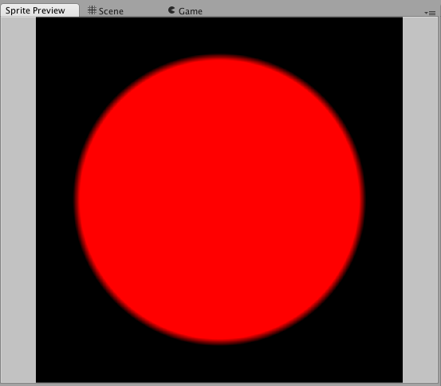

# For Users

SpriteMaker is a quick and dirty, in-progress extension for the Unity Editor to help you create some art assets without having to leave the engine.  It does not support texture generation (or anything) at runtime.  The tool was built solely for the sake of optimizing my own workflow at game jams, and as a learning experience.  If you still think SpriteMaker is something you're interested in, please read on.

##Usage Overview
Once you've downloaded the repo and imported the files into your project, you can open the primary SpriteMaker window by selecting
Window -> SpriteMaker

The editor Window currently consists of 3 elements:  File Ops, The Sprite Info Panel, and the Draw Command Queue

###File Ops
File Ops provides an interface for loading, saving and creating SpriteMakerAssets, ScriptableObjects used to save working files.

###Sprite Info
This Panel Allows you to select the name for your finished asset as well as its width and height in pixels.  There are buttons at the bottom of this panel for previewing and saving your asset.

###Draw Command Queue
The Draw Command Queue is where most of your work in SpriteMaker will happen.  SpriteMaker currently starts up with only a clear 'fill'-type Draw Command in the queue.

You can add more draw commands by selecting the type of draw command from the dropdown, and then pressing the "Insert New Draw Command" button next to the insert dropdown.  This will add a new draw command in the queue, for example a Circle Draw Command

The New Draw Command will appear next in the queue, with its exposed variables ready to be edited.  Int he case of the circle, we have Color, X Position, Y Position, Radius and Smoothness.  If we were to build the texture now, SpriteMaker would take the fill draw command and apply it to an empty canvas.  it would take the result of that operation and perform the next draw command, and this process would repeat for all draw commands found in the queue.

In fact, if we were to hit preview on that last Draw Command Queue, we would immediately be shown the following:

Confused about the values used to generate the preview?  SpriteMaker uses canvas-relative values to define measurements.  Let's take a look at what happens if we take this 64x64 image and export it at 1024x1024:

Perfect!  if we had defined the size and shape of the circle as pixel values, we would have had to re-enter all new pixel values to support a larger size image.

##Sprite Maker Preview Window
The only other window in SpriteMaker (so far?) is the Preview Window.  This window shows the current build of your asset without writing it to a file.  There's not a lot to it yet, but soon it may have support for previewing your textures with various filter modes and other fancy stuff.

##Where are my (BlendModes/Masks/Filters)
SpriteMaker is still in development!  BlendModes are first (and easiest) on the list, but it may take time to implement everything you would expect to see from this extension.  Let me know what you want!